# RadixScope — Technical Design

**Status:** Sections 2–4 (Stack Verification, Express Backend and Redis State) complete and current. Later sections remain placeholders pending later prompts.
**Companions:** `docs/architecture/system-architecture.md`, `docs/architecture/sglang-integration.md`

---

## 1. Overview

*(Placeholder — see `system-architecture.md` for boundaries, components and flows.)*

---

## 2. Stack Verification

### 2.0 Verdict

**No locked technology requires replacement.** No blocking incompatibility was found in the stack itself, so no approval is requested and nothing has been swapped.

One layer carries a genuine external dependency that could stop Day 0 dead: the host NVIDIA driver. It is a host-configuration question, not a stack question, and it has two in-scope resolutions (§2.2.3). Everything else is either cited-compatible or comfortably within budget.

**Chosen primary execution path:** native Ubuntu on the external HDD + the pinned SGLang Docker container (`lmsysorg/sglang:v0.5.18`), with Docker Engine and NVIDIA Container Toolkit. WSL2 is a **time-boxed recovery path**, not a second environment to keep working (§2.9).

### 2.1 Evidence classes

Every claim below carries one of three markers. They are not interchangeable, and the first one is currently empty.

| Marker | Meaning |
|---|---|
| `MEASURED` | Observed on the target laptop. **No row in this section is `MEASURED` yet.** The laptop has not been run. |
| `CITED` | From a primary source — NVIDIA CUDA release notes, SGLang v0.5.18 source or docs, the Qwen model card, or a package registry. Reference given inline. |
| `ESTIMATED` | Arithmetic or engineering judgement built on `CITED` inputs. Stated with its inputs so it can be checked. |

Two standing cautions:

- **A safetensors file size on disk is not a VRAM figure.** Weight VRAM below is computed from parameter count × bytes-per-parameter, not from file size. The two differ because of container format, index files, and what the loader materialises. Neither number predicts peak VRAM, which also includes CUDA context, activations, CUDA graph buffers and fragmentation.
- Every `ESTIMATED` VRAM and disk number is a planning figure. Step 5 of the Day 0 checklist replaces them with `MEASURED` values.

### 2.2 GPU, driver and CUDA layer

#### 2.2.1 Compute capability and BF16

| Item | Class | Value | Source |
|---|---|---|---|
| GPU | `CITED` | GeForce RTX 4060 Laptop GPU (GN21-X4), AD107 die, Ada Lovelace, 8 GB GDDR6, 128-bit bus, TGP configurable 35–115 W | Notebookcheck RTX 4060 Laptop GPU specifications |
| Compute capability | `CITED` | Ada Lovelace is compute capability **8.9 (sm_89)** | CUDA compute-capability reference; Ada Lovelace = 8.9 |
| BF16 support | `ESTIMATED` from `CITED` | Supported. Ada has 4th-generation Tensor Cores; bf16 has been a first-class tensor type since Ampere (8.0) and Ada is 8.9. | Ada tensor-core generation is cited; bf16 availability at sm_89 is the inference |
| PyTorch/SGLang kernel coverage at sm_89 | `CITED` | Install docs state FlashInfer is the default attention kernel backend and supports sm75 and above, naming L4/L40S (both Ada) among sm75+ devices | SGLang install docs, "Common Notes" |

**Reading:** sm_89 is a mainstream, well-covered target. BF16 at 8.9 is not exotic. Nothing here is a risk.

The TGP range matters for latency consistency, not correctness: a 35 W-configured chassis will produce slower but equally valid measurements. Keep the laptop on mains power and on a fixed power profile for the whole benchmark, or raw and normalized runs may differ for reasons that have nothing to do with prompt structure.

#### 2.2.2 Driver requirement — the one real gate

| Item | Class | Value | Source |
|---|---|---|---|
| CUDA 13.0 minimum Linux driver | `CITED` | **≥ 580.65.06** | NVIDIA published CUDA-and-driver combination list: "CUDA 13.0 with Driver 580.65.06+". Corroborated by the CUDA Toolkit release notes Table 2, which gives CTK 13.x → `>= 580` and 12.x → `>= 525, < 580`. |
| CUDA 12.9 minimum Linux driver | `CITED` | ≥ 570.42.01 | Same NVIDIA list: "CUDA 12.9 with Driver 570.42.01+". Relevant only on the §2.2.3 fallback path. |
| Release 580 supports Ada Lovelace | `CITED` | Yes — R580 supports CUDA 13.x for Ada Lovelace among other architectures | NVIDIA driver release notes, Release 580 branch |
| SGLang v0.5.18 default container CUDA | `CITED` | 13.0.3 | `docker/Dockerfile` L1–2 at tag v0.5.18 |
| Host driver on this laptop | **`RUNTIME_PENDING`** | Unknown | Day 0 step 1 |

**Consequence.** The `lmsysorg/sglang:v0.5.18` image is a CUDA 13 image. It needs a host driver ≥ 580.65.06. Forward compatibility packages, which let an older driver run a newer CUDA runtime, are a data-center-GPU feature and are not available on GeForce parts — so on this laptop the driver floor is hard, not negotiable by configuration.

Decision rule:

```
nvidia-smi driver version
  ├─ ≥ 580.65.06        →  lmsysorg/sglang:v0.5.18        (CUDA 13, preferred)
  ├─ 570.42.01 … 580.65.05  →  upgrade first; §2.2.3 fallback only if refused
  └─ < 570.42.01        →  driver upgrade is mandatory; no image works
```

#### 2.2.3 If the driver is below 580.65.06

Two in-scope resolutions, in preference order. Neither touches the locked stack.

1. **Upgrade the host driver to R580 (≥ 580.65.06) or later** on the Ubuntu install. Preferred: one change, keeps the CUDA 13 image, keeps the pin.
2. **Use a CUDA 12.9 variant of the v0.5.18 image.** The `-cu129` suffix convention is documented, and such tags demonstrably exist for earlier releases. **Whether one exists for `v0.5.18` is unverified.** Look up the actual tag list and record the exact observed string before it goes into any script. Do not construct a tag name from the pattern.

Not options: changing the SGLang pin, changing the model, quantizing, or moving to a cloud GPU.

### 2.3 VRAM budget

#### 2.3.1 Inputs

| Input | Class | Value | Source |
|---|---|---|---|
| Parameters | `CITED` | 1.54 B total (1.31 B non-embedding), tied word embeddings | Qwen2.5-1.5B-Instruct model card |
| Layers | `CITED` | 28 | Model card |
| Attention heads | `CITED` | GQA, 12 Q / 2 KV | Model card |
| Head dimension | `ESTIMATED` | 128 (hidden size 1536 ÷ 12 Q heads) | Derived; **verify** with `curl -s localhost:30000/get_model_info` and the model `config.json` |
| Precision | `CITED` | BF16, 2 bytes per parameter and per KV element | Model card tensor type; locked precision |
| Reported VRAM | `CITED` | 8 GB GDDR6 | GPU spec |

#### 2.3.2 Arithmetic — all `ESTIMATED`

Weights:

```
1.54e9 params × 2 bytes = 2.87 GiB
```

KV cache per token, BF16, GQA with 2 KV heads:

```
2 (K and V) × 28 layers × 2 KV heads × 128 head_dim × 2 bytes = 28,672 B = 28.0 KiB/token
```

A full 8192-token context therefore costs **224 MiB of KV**. That is the headline finding of this section: **on this model, KV cache is not the constraint.** Qwen2.5-1.5B's 2-KV-head GQA makes each token cheap, and a 1.5B model on 8 GB has room to spare.

Static pool at various `--mem-fraction-static` values:

| `mem-fraction-static` | Static pool | Minus weights → KV budget | Approx. KV capacity |
|---|---|---|---|
| 0.80 | 6.40 GiB | 3.53 GiB | ~132,000 tokens |
| **0.85 (locked baseline)** | **6.80 GiB** | **3.93 GiB** | **~147,000 tokens** |
| 0.90 | 7.20 GiB | 4.33 GiB | ~162,000 tokens |

At 0.85, the KV pool holds roughly **18 full 8192-token contexts**. RadixScope's benchmark issues three sequential requests per run against a freshly flushed cache. Eviction pressure during a run is, on these numbers, implausible.

**Why this matters beyond comfort:** the architecture ledger's V-5 risk was that continuous eviction would mask reuse and force the 0.5B fallback. On this arithmetic that risk is small. It is not zero — `num_retractions` is still recorded per request (see `sglang-integration.md` C-3) — but the fallback is now unlikely to trigger for memory reasons.

#### 2.3.3 What the arithmetic does not cover

Not included above, and all `ESTIMATED` at 0.6–1.2 GiB combined: CUDA context, cuBLAS/FlashInfer workspaces, CUDA graph capture buffers, activation peaks during prefill, and allocator fragmentation. SGLang's `mem-fraction-static` is documented as the fraction used for static allocation (model weights and KV pool), so this overhead sits *outside* that fraction and competes for the remaining ~1.2 GiB at 0.85.

Two host-side consumers can eat into that margin:

- **Display.** On a hybrid-graphics laptop under Ubuntu, whether the dGPU drives the display depends on the PRIME mode. In `on-demand` mode the iGPU drives the panel and the dGPU is nearly free; in `performance` mode the dGPU carries the desktop and loses 400–800 MiB. `ESTIMATED`. **Check `prime-select query` and prefer `on-demand`.**
- **A browser with the RadixScope dashboard open** may claim GPU memory for compositing if the dGPU is driving the display. Under `on-demand` this is a non-issue.

If step 5 shows the margin is tight, lower `--mem-fraction-static` to 0.80 — the KV budget stays enormous. Do **not** raise it to chase capacity that is not needed.

### 2.4 System RAM

| Item | Class | Value |
|---|---|---|
| Installed | `CITED` (locked spec) | 16 GB |
| SGLang host-side process set | `ESTIMATED` | 3–5 GB (tokenizer manager, scheduler, detokenizer, Python runtime, pinned host buffers) |
| Model download/load staging | `ESTIMATED` | Transient, up to ~3 GB during first weight load |
| Node/Express | `ESTIMATED` | 150–400 MB |
| Redis | `ESTIMATED` | < 100 MB (run and request state only — see `system-architecture.md` §8) |
| Vite dev server + browser | `ESTIMATED` | 1.5–3 GB (a Chromium tab with Chart.js is the largest single frontend cost) |
| Ubuntu desktop | `ESTIMATED` | 1.5–2.5 GB |
| **Total** | `ESTIMATED` | **8–13 GB of 16 GB** |

Workable, with less headroom than the VRAM picture. Two practical rules:

- `--shm-size 8g` on the container is a *limit*, not a reservation, but combined with `--ipc=host` it is worth keeping modest. The docs' 32 GB example is sized for an 8B model.
- Close other IDEs and browser windows during measured runs. Swap on an external HDD is punishing.

### 2.5 Storage — external HDD

This is the layer most likely to cost wall-clock time, and it costs it in the build window, not at benchmark time.

| Item | Class | Value |
|---|---|---|
| Docker image, compressed | `CITED` | Docker Hub tag listings for `lmsysorg/sglang` show amd64 compressed sizes of roughly 12–14 GB (`latest-cu130-runtime` ≈ 12.07 GB, `latest-runtime` ≈ 13.94 GB, `latest-cu130` ≈ 14.09 GB). **These figures were observed against a different version tag's listing and are indicative of image scale, not of v0.5.18 exactly.** |
| Docker image, on disk after pull | `ESTIMATED` | 25–40 GB uncompressed |
| Model weights on disk | `ESTIMATED` | ~3.1 GB of safetensors plus tokenizer and config files. **This is a disk figure. It is not the VRAM figure in §2.3.2.** |
| HF cache overhead | `ESTIMATED` | 1–2 GB (blobs, refs, incomplete downloads) |
| Fallback 0.5B model | `ESTIMATED` | ~1 GB |
| Docker build/overlay working space | `ESTIMATED` | 5–10 GB |
| **Minimum free space to require** | `ESTIMATED` | **60 GB**, with 80 GB comfortable |

Time costs, all `ESTIMATED` on a mechanical external drive over USB:

- Image pull and extraction: **20–60 minutes.** Extraction is the slow part, not the download, and it is single-threaded I/O against a spinning disk. **Do this first, before anything else on Day 0.**
- First model load from HDD into VRAM: **1–4 minutes.** Subsequent loads benefit from the page cache if RAM allows.
- First FlashInfer JIT compilation, if the image's shipped JIT cache does not cover sm_89: **several minutes, once.** The v0.5.18 Dockerfile installs `flashinfer-cubin` and optionally `flashinfer-jit-cache` (`CITED`, `docker/Dockerfile`), so this may not occur at all. Watch the first startup log; do not mistake a one-off JIT compile for a hang.

**No repartitioning and no destructive disk changes.** All persistence is achieved with bind mounts onto existing filesystem paths (§2.7).

### 2.6 Container layer

| Item | Class | Notes |
|---|---|---|
| Docker Engine on Ubuntu | `CITED`-compatible | Standard `apt` install from Docker's official repository. Add the user to the `docker` group to avoid `sudo` in scripts. |
| NVIDIA Container Toolkit | `CITED`-compatible | Required for `--gpus all`. Install from NVIDIA's `libnvidia-container` apt repository, then `sudo nvidia-ctk runtime configure --runtime=docker && sudo systemctl restart docker`. |
| Docker data root on external HDD | `ESTIMATED` | If `/var/lib/docker` sits on the internal SSD but Ubuntu itself is on the HDD, confirm which device actually holds it before checking free space. Relocating the data root is possible but is **not recommended inside a 48-hour window** — it is a systemd/daemon.json change with a copy step, and the failure mode is a broken Docker. Prefer freeing space over moving the root. |
| `--ipc=host`, `--shm-size` | `CITED` | Both appear in the official docker run example. |
| Image immutability | `CITED` | Docs: `latest` and `dev` are mutable; pin an immutable version tag. RadixScope pins `v0.5.18`. |

**Not added:** docker-compose for SGLang, Kubernetes, any orchestration. One `docker run` command, recorded in `ops/sglang/`.

Redis and the Node/React side run **natively**, not in containers. Containerising them would add compose orchestration for no benefit at this scale, and Redis on the HDD via a container volume is strictly worse than a native install with an in-memory-only configuration.

### 2.7 Persistent cache mounts

Two bind mounts, both onto existing paths, no partitioning:

```bash
-v ~/.cache/huggingface:/root/.cache/huggingface \
-v ~/.cache/flashinfer:/root/.cache/flashinfer
```

The Hugging Face mount is `CITED` — it appears in the official docker run example — and is what stops the model being re-downloaded on every container restart. The FlashInfer mount is `ESTIMATED` as useful: the install docs reference `~/.cache/flashinfer` as the JIT cache location, so persisting it across container restarts avoids repeating any first-run compilation. If the directory turns out to be unused, the mount is harmless.

Both live under the user's home directory on the external HDD. Slow, but persistent, which is the point — a re-download over HDD is the expensive event, not a cache read.

### 2.8 Application layer

Versions checked against the npm registry at the time of writing (`CITED`):

| Package | Latest | Notes |
|---|---|---|
| `express` | 5.2.1 | Express 5 is fine for four endpoints. If the team is more fluent in Express 4, use 4 — this is not a locked sub-version and 48 hours is not the moment to learn a new major. |
| `chart.js` | 4.5.1 | Locked charting library. |
| `react-chartjs-2` | 5.3.1 | React wrapper for Chart.js 4. |
| `ioredis` | 6.0.0 | Or `node-redis`; either is fine. `ioredis` has the simpler API for this use. |
| `react` | 19.2.8 | Locked frontend framework. |
| `vite` | 8.2.2 | Dev server and build tool. Not Next.js. |

| Item | Class | Verdict |
|---|---|---|
| Node.js version | `ESTIMATED` | Use a current LTS. All of the above are mainstream on LTS Node; no exotic requirement. |
| Redis | `ESTIMATED` | Stock `apt` Redis, default config, no persistence needed. RadixScope's state is per-run and TTL'd. Disabling RDB/AOF avoids HDD write stalls — a real consideration here. |
| React + Chart.js + HTTP polling | `ESTIMATED` | No compatibility concern. A 1-second poll against a local Express is trivial load. |
| Frontend ↔ inference isolation | `CITED` (architecture) | The frontend is outside the inference path. Its resource use affects nothing measured, except through host RAM and possibly display VRAM (§2.3.3). |

No WebSockets, no SSE to the browser, no Next.js, no FastAPI. Express may consume SGLang's native streaming `/generate` internally for `ttft_ms` — that is an Express↔SGLang concern and creates no frontend transport (see `sglang-integration.md` C-9).

### 2.9 Ports

| Port | Service | Class | Conflict risk |
|---|---|---|---|
| 30000 | SGLang HTTP | `CITED` (SGLang default, `server_args.py` L1278) | Low. |
| 8080 | Express | `ESTIMATED` | **Moderate — the highest of the four.** 8080 is heavily used by other dev tooling. Consider 8787 or 3001 if `ss -ltnp` shows it taken. |
| 6379 | Redis | `ESTIMATED` | Low unless another Redis is already running. |
| 5173 | Vite dev server | `ESTIMATED` | Low. |

Check all four at once before starting anything:

```bash
ss -ltnp | grep -E ':(30000|8080|6379|5173)\b' || echo "all four free"
```

Bind Express and Redis to `127.0.0.1`. SGLang binds `0.0.0.0` **inside the container only**; the host-side publish is `-p 30000:30000`, which reaches loopback. Nothing in this system should be reachable from the local network.

### 2.10 WSL2 — time-boxed recovery, not a parallel environment

WSL2 is a **recovery path**, invoked only when native Ubuntu has failed against a stated trigger. It is not maintained in parallel, and no artifact is validated twice.

- **Trigger:** the native Ubuntu path exceeds its per-layer troubleshooting budget (§2.12) at the GPU, driver or container layer.
- **Box:** **3 hours total.** If WSL2 has not produced a healthy SGLang server in 3 hours, stop and escalate to the 0.5B fallback or to a reduced demonstration — do not keep alternating environments.
- **Known differences to expect, all `ESTIMATED`:** WSL2 GPU passthrough uses the Windows host driver via `/usr/lib/wsl/lib`, so the driver floor is set by the *Windows* driver version; WSL2 memory is capped by a `.wslconfig` default that may need raising on a 16 GB machine; and filesystem performance differs sharply between `/mnt/c` (slow) and the WSL2 ext4 VHD (fast) — keep the HF cache inside the VHD if the SSD has room.
- **What does not change:** the pin, the model, the benchmark settings, the flush protocol. A WSL2 run is a valid run; it is simply recorded as such in the run fingerprint, because a cross-environment comparison would violate the same-hardware requirement.

### 2.11 Minimum environment checks

Run in order. Each has a pass condition and a budget. Stop at the first hard failure.

| # | Layer | Command | Pass |
|---|---|---|---|
| 1 | Driver | `nvidia-smi` | Reports the GPU and a driver ≥ 580.65.06. Record version and free VRAM. |
| 2 | Container GPU visibility | `docker run --rm --gpus all nvidia/cuda:13.0.3-base-ubuntu24.04 nvidia-smi` | GPU visible inside the container. |
| 3 | Disk | `df -h ~` and `docker info \| grep "Docker Root Dir"` | ≥ 60 GB free on the device holding the Docker root. |
| 4 | Ports | `ss -ltnp \| grep -E ':(30000\|8080\|6379\|5173)\b'` | All four free, or alternatives chosen. |
| 5 | Model startup | The pinned `docker run` from `sglang-integration.md` §3.1 | Server reaches ready. Record startup wall time, effective attention backend and page size from the log. |
| 6 | Health | `curl -s -o /dev/null -w '%{http_code}\n' localhost:30000/health` | `200`. Never `/health_generate`. |
| 7 | 8192-context request | Send a prompt near the context limit with the locked sampling params | Completes without a context or OOM error. |
| 8 | Cache capacity | `curl -s localhost:30000/get_server_info \| jq '.memory_usage'` | Record KV GB and `max_total_num_tokens`; compare against §2.3.2. |
| 9 | Redis | `redis-cli ping` | `PONG`. |
| 10 | Express | `curl -s localhost:8080/api/health` | Reports Express, Redis and SGLang all reachable. |
| 11 | Frontend poll | Open the dashboard; observe the poll in the network tab | `GET /api/benchmark/:runId` returning at ~1 s intervals. |

Steps 1, 2 and 5 are the gates. Steps 6–11 are confirmations.

### 2.12 PASS/FAIL thresholds, troubleshooting budgets and fallback triggers

| Layer | PASS | FAIL | Max troubleshooting | On FAIL |
|---|---|---|---|---|
| Driver / CUDA | `nvidia-smi` reports driver ≥ 580.65.06 | Driver < 580.65.06 and cannot be upgraded | **60 min** | Look up and record the exact CUDA 12.9 v0.5.18 tag; if none exists, go to WSL2 recovery (§2.10) |
| Container GPU passthrough | Step 2 shows the GPU | Toolkit not configured, or GPU invisible | **45 min** | Re-run `nvidia-ctk runtime configure`, restart Docker; then WSL2 recovery |
| Disk | ≥ 60 GB free on the Docker root device | < 60 GB and cannot be freed | **30 min** | Free space; do **not** relocate the Docker data root under time pressure |
| Image pull | Image present locally | Pull or extraction fails | **90 min** (HDD extraction is genuinely slow — slow is not failure) | Retry once; then WSL2 recovery with the SSD-backed VHD |
| Model startup (1.5B) | Server ready, no OOM, 8192-context request succeeds | OOM at 0.85, still OOM at 0.80, or repeated crashes | **90 min** | **Fallback trigger fires** → `Qwen/Qwen2.5-0.5B-Instruct`, recorded with its reason |
| KV capacity | `max_total_num_tokens` ≥ 40,000 (comfortably above the ~25k a 3-request run could need) | Below that, or eviction observed mid-run | **30 min** | Lower `mem-fraction-static` to 0.80 first; only then the 0.5B fallback |
| Cold-start behaviour | First post-flush request within the runtime-derived tolerance | Warm start that cannot be explained or eliminated | **60 min** | This is a benchmark-validity failure, not a stack failure — apply the `sglang-integration.md` §7 demotion path |
| Redis / Express / React | Steps 9–11 pass | Any fails | **30 min each** | Ordinary application debugging; no fallback path needed |

**Total Day 0 budget: 6 hours.** If the stack is not green after 6 hours, the correct call is to reduce scope — 0.5B model, or a demonstration with fewer measured dimensions — not to extend the budget into the build time.

**Fallback triggers, precisely:**

1. **0.5B model** — fires only on the "Model startup (1.5B)" or "KV capacity" FAIL rows above, after `mem-fraction-static 0.80` has been tried. Recorded in the run document with the observed error. Nothing else substitutes: no quantization, no other family, no cloud.
2. **WSL2 recovery** — fires only on a driver, passthrough or image-pull FAIL that survived its budget. 3-hour box. Native Ubuntu is not maintained in parallel afterwards.
3. **Benchmark demotion** — fires on the cold-start row, and is governed by `sglang-integration.md` §7, not by this document.

### 2.13 Compatibility matrix

| Layer | Locked choice | Class | Verdict | Binding constraint |
|---|---|---|---|---|
| GPU | RTX 4060 Mobile, 8 GB, sm_89 | `CITED` | **Compatible** | — |
| Precision | BF16 | `ESTIMATED` from `CITED` | **Compatible** | — |
| Driver | Host NVIDIA | `RUNTIME_PENDING` | **Gate** | ≥ 580.65.06 for CUDA 13 image |
| CUDA | 13.0.3 in image | `CITED` | **Compatible** | Driver floor above |
| Container runtime | Docker + NVIDIA Container Toolkit | `CITED` | **Compatible** | Toolkit must be configured |
| SGLang | `lmsysorg/sglang:v0.5.18` | `CITED` | **Compatible** | Image existence confirmed by pull |
| Model | Qwen2.5-1.5B-Instruct BF16, ctx 8192 | `CITED` + `ESTIMATED` | **Compatible, comfortable** | ~2.87 GiB weights; 28 KiB/token KV |
| Tokenizer | Served checkpoint's own, via `/tokenize` | `CITED` | **Compatible** | — |
| KV capacity | `mem-fraction-static 0.85` | `ESTIMATED` | **Ample** (~147k tokens) | Not the constraint |
| System RAM | 16 GB | `ESTIMATED` | **Adequate** | 8–13 GB projected use |
| Disk | External HDD | `ESTIMATED` | **Adequate if ≥ 60 GB free** | Extraction time, not capacity |
| Node / Express | Express 5.2.1 on LTS Node | `CITED` | **Compatible** | — |
| Redis | Stock apt Redis, no persistence | `ESTIMATED` | **Compatible** | Disable RDB/AOF on HDD |
| React / Chart.js | React 19.2.8, Chart.js 4.5.1, react-chartjs-2 5.3.1, Vite 8.2.2 | `CITED` | **Compatible** | — |
| Transport | HTTP polling, frontend ↔ Express | `CITED` (architecture) | **Compatible** | — |
| Ports | 30000 / 8080 / 6379 / 5173 | `ESTIMATED` | **Compatible** | 8080 is the likeliest clash |
| OS (primary) | Native Ubuntu on external HDD | `ESTIMATED` | **Primary path** | — |
| OS (recovery) | Windows 11 + WSL2 | `ESTIMATED` | **Time-boxed recovery only** | 3-hour box |

### 2.14 Benchmark settings — unchanged

`temperature=0`, `n=1`, `max_new_tokens=256`, `concurrency=1`, no speculative decoding, no MTP. Identical model and settings for raw and normalized. Independent verified flushes before each run, with cold first-request `cached_tokens` validation and warm-start invalidation, exactly as specified in `sglang-integration.md` §6. Nothing in this stack verification changes any of it.

---


## 3. Express Backend

**Scope:** one Express application. Not a gateway, router, proxy, scheduler, queueing platform, plugin host, or metrics service. It is a single Node process that orchestrates a fixed workload, sequences one benchmark, and serves four HTTP endpoints.

**Inputs to this design:** `system-architecture.md` (components C1–C12, flows, invariants), `sglang-integration.md` (verified `v0.5.18` contract), `README.md` §2 (requirement IDs).

**Naming:** field and type names below are **proposed**, not final. Prompt 12 owns the data contract and may rename freely. Module and directory names are settled here.

### 3.1 Module inventory and merge decisions

Eleven candidate modules were offered. Nine are retained as-is, two candidates were merged into neighbours, and one candidate was split across two owners. Each retained module is justified by a MUST.

| Module | Directory | Justified by | Decision |
|---|---|---|---|
| M1 `config` | `server/src/config/` | B-1, D-1, D-2, D-3 | Retained |
| M2 `contracts` | `server/src/contracts/` | O-1 | Retained (shared types + validation) |
| M3 `sglangClient` | `server/src/sglang/` | B-2, O-4, D-3 | Retained; **cache-observation parser merged in** |
| M4 `workload` | `server/src/workload/` | F-2, F-6, S-5 | Retained |
| M5 `promptAssembler` | `server/src/prompt/assemble/` | F-3, S-1, S-3, S-4 | Retained |
| M6 `normalizer` | `server/src/prompt/normalize/` | N-1 … N-6 | Retained — **deliberately not merged** |
| M7 `benchmarkRunner` | `server/src/benchmark/runner/` | F-1, F-5, B-2, B-3, B-6, B-7 | Retained; **telemetry-record assembly folded in** |
| M8 `validity` | `server/src/benchmark/validity/` | B-3, B-4, B-6, B-8 | Retained |
| M9 `analysis` | `server/src/analysis/` | O-6 | Retained; **diagnostics engine merged in** |
| M10 `store` | `server/src/store/` | NF-5, S-8, S-9 | Retained |
| M11 `api` | `server/src/api/` | F-1, F-8, F-9 | Retained |

**Merge rationale.**

*Cache-observation parser → M3.* Parsing `meta_info` is the act of crossing the SGLang trust boundary. Splitting it out would put the contract in one module and its interpretation in another, which is exactly where a version drift would hide. It ships as a pure exported function (`parseMetaInfo`) inside M3 so it stays unit-testable without an HTTP call.

*Diagnostics engine → M9.* Diagnostics are a handful of pure heuristics over the same token arrays the analyzer already holds. A separate module would be one file, one import, and no new capability.

*Telemetry recorder → split.* Record *assembly* needs the runner's clocks and mode context, so it lives in M7 as a pure `buildRecord()`. Record *persistence* is a Redis write and lives in M10. A third module owning both would sit between them adding nothing.

**Why M6 stays separate.** Normalization is the highest-risk module in the system: it is the only one permitted to change a prompt, and six MUSTs (N-1…N-6) plus four safety MUSTs (S-1, S-2, S-6, and the whitelist behind S-2) constrain it. Folding it into the assembler would make "unchanged by default" an internal branch rather than an architectural fact. The separation is worth the one extra file.

### 3.2 Dependency diagram

```
                        ┌──────────────┐
                        │  M11  api    │  thin: parse, delegate, serialize
                        └──────┬───────┘
                               │
                        ┌──────▼──────────────┐
                        │ M7 benchmarkRunner  │  the ONLY sequencer
                        │  state machine      │  owns clocks + single-flight
                        └──┬───┬───┬───┬───┬──┘
             ┌─────────────┘   │   │   │   └─────────────┐
             ▼                 ▼   │   ▼                 ▼
      ┌─────────────┐  ┌────────────┐  ┌────────────┐  ┌──────────┐
      │ M4 workload │  │ M5 prompt  │  │ M8 validity│  │ M10 store│
      │             │  │  Assembler │  │   (pure)   │  │  (Redis) │
      └─────────────┘  └─────┬──────┘  └────────────┘  └──────────┘
                             │
                       ┌─────▼────────┐        ┌──────────────┐
                       │ M6 normalizer│        │ M9 analysis  │◄── M7
                       │    (pure)    │        │   (pure)     │
                       └──────────────┘        └──────────────┘

                       ┌──────────────────┐
                       │ M3 sglangClient  │◄── M7 (only caller)
                       │  HTTP + parse    │
                       └──────────────────┘

      M1 config  ──────► imported by all
      M2 contracts ────► imported by all      (types only, no runtime deps)
```

**Rules the diagram encodes:**

- Arrows point one way. There are no cycles and no back-references.
- **M11 never calls M3, M4, M5, M6, M8 or M9.** Routes parse input, call one runner or store method, and serialize. A route containing an `if` about benchmark phase is a bug.
- **M3 is the only module that knows SGLang exists as HTTP.** No other module holds a URL, a header, a status code, or a `meta_info` shape.
- **M7 is the only sequencer.** No other module decides what happens next.
- **M6, M8, M9 are pure.** No I/O, no clock, no randomness. They take data and return data, which is what makes them the parts worth unit-testing in a 48-hour build.
- **M10 is the only module that imports a Redis client.** No ORM, no repository-per-entity explosion — one adapter with about eight methods.

### 3.3 Module specifications

#### M1 `config`

- **Responsibility:** load, validate and freeze all configuration at boot. Expose the locked benchmark settings as immutable constants.
- **Inputs:** environment variables, defaults.
- **Outputs:** one frozen `Config` object.
- **Dependencies:** M2.
- **Owned state:** the frozen config. Nothing else.
- **Errors:** throws at boot on invalid config. Never throws afterwards.
- **Public interface:** `loadConfig(): Config`, `LOCKED_SAMPLING` (frozen: `{ temperature: 0, n: 1, max_new_tokens: 256 }`), `CONCURRENCY = 1`.
- **Forbidden:** runtime mutation; reading env anywhere else in the codebase; exposing the sampling params as a mutable object.

`LOCKED_SAMPLING` being frozen and imported by exactly one caller (M7) is how B-1 is enforced structurally rather than by discipline.

#### M2 `contracts`

- **Responsibility:** shared TypeScript types and runtime validators for everything crossing a module or process boundary.
- **Inputs / Outputs:** types; validator functions.
- **Dependencies:** none (a schema library such as zod is acceptable; nothing else).
- **Owned state:** none.
- **Errors:** validators return a discriminated result; they do not throw.
- **Public interface (proposed names — Prompt 12 to formalize):** `RunId`, `RunPhase`, `RunMode` (`RAW` | `NORMALIZED`), `AgentId` (`planner` | `worker1` | `worker2`), `PromptComponent`, `ComponentKind`, `AssembledPrompt`, `TelemetryRecord`, `NativeFields`, `MeasuredFields`, `DerivedFields`, `ValidityVerdict`, `ReasonCode`, `ComparisonDoc`, `ServerFingerprint`.
- **Forbidden:** any I/O; any business logic; importing any other module.

`TelemetryRecord` carries three named sub-objects (`native`, `measured`, `derived`) rather than a flat bag. O-1 is a type-level guarantee: a value cannot be read without traversing its provenance.

#### M3 `sglangClient`

- **Responsibility:** every HTTP interaction with the one local SGLang worker, plus parsing of its responses.
- **Inputs:** assembled prompt text; flush requests; `AbortSignal`.
- **Outputs:** `GenerateResult { text, native: NativeFields, firstTokenAt? }`; `FlushResult`; `ServerFingerprint`; `TokenizeResult`.
- **Dependencies:** M1, M2.
- **Owned state:** the base URL and timeout policy. No run state.
- **Errors:** `SglangUnreachableError`, `SglangHttpError(status, body)`, `FlushRefusedError`, `MetaInfoMissingError`. All typed; none leak `fetch` internals upward.
- **Public interface:**
  ```
  generate(prompt: string, opts: { stream: boolean, signal: AbortSignal }): Promise<GenerateResult>
  flushCache(signal: AbortSignal): Promise<FlushResult>        // POST /flush_cache?timeout=30
  health(): Promise<boolean>                                   // GET /health  — never /health_generate
  serverInfo(): Promise<ServerFingerprint>                     // GET /get_server_info
  tokenize(text: string): Promise<TokenizeResult>              // POST /tokenize
  parseMetaInfo(raw: unknown): NativeFields                    // pure, exported for tests
  ```
- **Forbidden:** deciding *when* to flush or generate; retrying `/generate` or `/flush_cache`; calling `/health_generate`; touching Redis; being described as a gateway or proxy. It exposes exactly the five verified endpoints and no generic passthrough.

**Verified contract, `v0.5.18` only.** `generate` sends `{ text, sampling_params, stream }` and reads `meta_info`: `prompt_tokens`, `completion_tokens`, `cached_tokens`, `finish_reason`, `num_retractions`, `weight_version`, plus `forward_entry_time` / `prefill_finished_time` / `queue_time` under `--enable-metrics`. `flushCache` treats HTTP 200 as success and 400 as failure. `parseMetaInfo` throws `MetaInfoMissingError` when `cached_tokens` is absent or non-numeric rather than defaulting it — a missing value must invalidate a run, never silently read as zero.

**Retry policy.** Only `health()` and `serverInfo()` retry, and only when called outside a run. `generate` and `flushCache` never retry: a retried generate would corrupt the cold-start premise, and a retried flush would mask a busy server.

#### M4 `workload`

- **Responsibility:** define the fixed three-agent sequence and its causality.
- **Inputs:** conversation state so far.
- **Outputs:** the next `AgentTurn { agentId, componentSet }`, or done.
- **Dependencies:** M2.
- **Owned state:** none — the sequence is a constant; conversation state is passed in.
- **Errors:** throws only on programmer error (unknown agent).
- **Public interface:** `agentSequence(): AgentId[]`, `componentsFor(agentId, conversation): PromptComponent[]`.
- **Forbidden:** issuing requests; reordering or parallelising agents; knowing about modes, flushes or benchmarks.

F-6 and S-5 hold because `agentSequence()` returns a frozen array and M7 iterates it with `await` inside the loop. Causality is a property of the loop, not a check.

#### M5 `promptAssembler`

- **Responsibility:** turn classified components into a single prompt string, in the correct order, for a given mode.
- **Inputs:** `PromptComponent[]`, `mode`.
- **Outputs:** `AssembledPrompt { text, manifest, normalizationApplied, refusals[] }`.
- **Dependencies:** M2, M6.
- **Owned state:** none. Pure.
- **Errors:** `SystemPrecedenceViolation`, `UnclassifiedComponentError` — both programmer errors, thrown at assembly time.
- **Public interface:** `assemble(components, mode): AssembledPrompt`.
- **Forbidden:** rewriting component content; calling M6 when `mode === RAW`; emitting a prompt whose position 0 is not the `SYSTEM` block.

In `RAW` mode M5 does not import a code path through M6 at all. N-1 ("unchanged by default") is therefore observable as a branch that never touches the normalizer, and A-7 (byte-identical pass-through) is testable without mocking.

#### M6 `normalizer`

- **Responsibility:** deterministic, reversible reordering of eligible components only.
- **Inputs:** `PromptComponent[]` with kinds.
- **Outputs:** `{ ordered: PromptComponent[], moved: ComponentId[], refusals: Refusal[] }`.
- **Dependencies:** M2.
- **Owned state:** none. Pure, and free of clocks and randomness so N-2 holds by construction.
- **Errors:** none thrown. Uncertainty produces a `Refusal`, not an exception — a refusal is a result, per N-5.
- **Public interface:** `normalize(components): NormalizeResult`, `invert(ordered, manifest): PromptComponent[]`.
- **Forbidden:** moving or splitting `SYSTEM`; moving any component whose kind is not in `{ SHARED_STATIC, AGENT_RULES, DYNAMIC_METADATA }`; raising untrusted content above trusted instructions; reordering conversation turns or tool call/result pairs; altering content of any kind.

`invert()` exists solely to make N-4 testable: `invert(normalize(x).ordered, manifest) === x` is one property test and it covers reversibility for every input.

#### M7 `benchmarkRunner`

- **Responsibility:** the entire benchmark state machine. The only module that sequences anything.
- **Inputs:** a start request.
- **Outputs:** run documents, telemetry records and a verdict, all persisted through M10.
- **Dependencies:** M1, M2, M3, M4, M5, M8, M9, M10.
- **Owned state:** the in-process single-flight guard, the active `AbortController`, and the monotonic clocks for the request currently in flight.
- **Errors:** catches everything from M3 and M10 and converts it to a terminal `INVALID` state with a `ReasonCode`. Never propagates an SGLang error to a route.
- **Public interface:**
  ```
  startRun(opts: { normalizeSecondRun: boolean }): Promise<{ runId: RunId }>   // throws RunInProgressError
  isRunning(): boolean
  ```
- **Forbidden:** HTTP details; Redis commands; prompt content decisions; being invoked concurrently.

**Protected windows are enforced here and only here.** Between a successful `flushCache()` and the first `generate()` of that run, M7 makes no other call through M3. `serverInfo()` and `tokenize()` are called during PREFLIGHT and after the final request. This is B-7, and it is a property of one function's call order rather than a rule spread across modules.

#### M8 `validity`

- **Responsibility:** decide whether a run is valid. Sole authority to produce `INVALID`.
- **Inputs:** run document, telemetry records, resolved tolerance, server fingerprints.
- **Outputs:** `ValidityVerdict { valid: boolean, reason?: ReasonCode, evidence }`.
- **Dependencies:** M2.
- **Owned state:** none. Pure.
- **Errors:** none. It returns verdicts; it does not throw.
- **Public interface:**
  ```
  resolveTolerance(fingerprint): number | null      // null ⇒ runner must refuse to start
  assertCold(firstRecord, tolerance): Verdict
  assertSettingsEqual(rawRun, normRun): Verdict
  assertContentEqual(rawRun, normRun): Verdict
  assertServerUnchanged(fpA, fpB): Verdict
  ```
- **Forbidden:** widening a tolerance to accommodate an observed value; inferring a tolerance when the page size is unresolved; producing a comparison.

`resolveTolerance` returning `null` is how B-4 is enforced: M7 refuses to start rather than guessing. That is a refused start, not an invalid run, and the two are distinct states.

#### M9 `analysis`

- **Responsibility:** all `RADIXSCOPE_DERIVED` computation — longest common token prefix, first divergence index, reuse ratios, raw↔normalized deltas, and variability diagnostics.
- **Inputs:** token-ID arrays and native fields.
- **Outputs:** `DerivedFields`, `ComparisonDoc`.
- **Dependencies:** M2.
- **Owned state:** none. Pure.
- **Errors:** none.
- **Public interface:** `longestCommonPrefix(a, b): number`, `firstDivergenceIndex(a, b): number`, `reuseRatio(native): number`, `diagnose(...): Diagnostic[]`, `compare(rawRun, normRun): ComparisonDoc`.
- **Forbidden:** tagging any output as `SGLANG_NATIVE`; mapping a token index onto a named prompt component (that is section-boundary mapping, which is cut — see README CONFLICT-3); emitting a comparison when the verdict is invalid.

#### M10 `store`

- **Responsibility:** the only Redis access in the process.
- **Inputs / Outputs:** run documents, telemetry records, verdicts, comparisons, the orphan-run marker.
- **Dependencies:** M2, a Redis client.
- **Owned state:** the connection.
- **Errors:** `StoreUnavailableError`. M7 converts it to `INVALID / RUNTIME_ERROR`.
- **Public interface:**
  ```
  createRun(doc): Promise<void>
  updateRunPhase(runId, phase): Promise<void>
  appendRecord(runId, record): Promise<void>
  putVerdict(runId, verdict): Promise<void>
  putComparison(runId, comparison): Promise<void>
  getRunProjection(runId): Promise<RunProjection | null>
  listRunSummaries(n): Promise<RunSummary[]>
  acquireBenchmarkLease(owner): Promise<boolean>
  renewBenchmarkLease(owner): Promise<boolean>
  releaseBenchmarkLease(owner): Promise<boolean>
  ```
- **Forbidden:** pub/sub, streams, lists-as-queues — **Redis is not an event bus**; storing prompt libraries; mirroring SGLang state; any ORM or entity-mapping layer.

Keys are namespaced `run:{runId}:*` with a TTL (S-8, S-9). `getRunProjection` computes the poll response server-side on each call, which is what keeps polling stateless.

#### M11 `api`

- **Responsibility:** four HTTP endpoints. Parse, delegate, serialize.
- **Dependencies:** M2, M7, M10.
- **Owned state:** none.
- **Errors:** maps `RunInProgressError` → 409, unknown `runId` → 404, validation failure → 400, everything else → 500.
- **Public interface:**

  | Method | Path | Delegates to |
  |---|---|---|
  | `POST` | `/api/benchmark` | `runner.startRun()` → `202 { runId }` |
  | `GET` | `/api/benchmark/:runId` | `store.getRunProjection()` |
  | `GET` | `/api/health` | `store` ping + `sglangClient.health()` via runner |
  | `GET` | `/api/runs` | `store.listRunSummaries()` (F-10, NICE — cut first if time runs short) |

- **Forbidden:** benchmark logic; SGLang calls; direct Redis commands; any streaming response; any fifth endpoint added casually.

**Invalid runs are returned, not hidden.** `getRunProjection` on an invalid run returns the phase, the reason code, the evidence, every telemetry record, and the observed first-request `cached_tokens`. The `comparison` and any improvement fields are **absent from the payload**, not present-and-null. A frontend cannot render an improvement that was never serialized.

### 3.4 Synchronous versus asynchronous

| Async (I/O, awaited, cancellable) | Synchronous (pure, instant, unit-testable) |
|---|---|
| `sglangClient.generate` / `flushCache` / `health` / `serverInfo` / `tokenize` | `promptAssembler.assemble` |
| every `store.*` method | `normalizer.normalize` / `invert` |
| `runner.startRun` (returns after the lock is taken; the run continues in the background) | all of `validity` |
| route handlers | all of `analysis` |
| | `sglangClient.parseMetaInfo` |
| | `config` (frozen at boot) |

Every calculation that matters for correctness is in the right-hand column. That is deliberate: with 48 hours, the tests that pay for themselves are pure-function tests over the normalizer, the validity predicates and the prefix analyzer.

### 3.5 Overlapping runs and cancellation

**Single-flight.** The fast-path authority is an **in-process guard** in M7, because NF-2 fixes the system at exactly one Express process. Redis also holds the owner-checked expiring overlap lease defined in §4.6. It closes the restart/stale-process window and identifies an orphaned run; it is not Redlock, scheduling or support for a second Express process.

`POST /api/benchmark` while `isRunning()` returns `409` immediately. There is no queue, no wait, no coalescing onto the in-flight run.

**Cancellation.** M7 holds one `AbortController` per run and passes its signal into every M3 call. It fires on process shutdown (SIGTERM) and on a per-request timeout. On abort, the run transitions directly to terminal `INVALID / RUNTIME_ERROR`.

Two things worth stating plainly:

*There is no user-facing cancel endpoint.* The locked API surface is four endpoints, and a cancel route would be a fifth. Given `max_new_tokens=256` at `concurrency=1`, the longest a user can be stuck is one bounded generation. Adding cancellation is a SHOULD for a later prompt to authorise, not a decision to take here.

*Aborting the HTTP connection does not stop SGLang's work.* The server keeps generating, which means the scheduler is not idle, which means the **next** `/flush_cache` can fail. `/abort_request` does exist in `v0.5.18` source but has **not** been verified for RadixScope use and is not in the verified contract. The safe behaviour, and the one specified here: after an abort, M7 does not immediately start another run; the next `startRun` calls `flushCache` with the verified `?timeout=30`, which waits for idle and reports honestly if it cannot get there.

**Timeouts (proposed, to be confirmed against §2.9 step 3 wall times):** `generate` 120 s; `flushCache` 45 s (server-side wait is 30 s); `health` and `serverInfo` 5 s.

### 3.6 Call trace — `POST /api/benchmark`

```
M11 route
  → validate body { normalizeSecondRun: boolean }        sync
  → M7.startRun()                                        async
      ├─ isRunning()? → yes ⇒ throw RunInProgressError ⇒ 409
      ├─ take in-process guard; mint runId + random owner token
      ├─ M10.acquireBenchmarkLease(owner); M10.createRun(doc)
      └─ return { runId }  ⇒ 202              ← route responds HERE
                                                 the run continues in background
```

The route returns as soon as the lock is taken. Everything below runs after the response.

### 3.7 Call trace — the benchmark itself (background)

```
PREFLIGHT
  M3.health()                                  → 200 required
  M3.serverInfo()                              → ServerFingerprint  [SGLANG_NATIVE]
  M8.resolveTolerance(fingerprint)             → null ⇒ REFUSE TO START (not INVALID)
  M3.tokenize(...) for each component set      → token IDs  [SGLANG_NATIVE]
  M1.LOCKED_SAMPLING frozen into the run doc

FLUSH_RAW
  M3.flushCache()                              → 200 required, else INVALID/FLUSH_FAILED
  ╔═══════════ protected window: no M3 call until the first generate ═══════════╗

RUN_RAW  (for agent of M4.agentSequence(), sequentially, awaited)
  M4.componentsFor(agent, conversation)        sync
  M5.assemble(components, RAW)                 sync   → M6 NOT invoked
  t0 = monotonic
  M3.generate(prompt, { stream, signal })      async  → text + NativeFields
  t1/t2 captured                                      → MeasuredFields
  M7.buildRecord(...)                          sync
  M10.appendRecord(runId, record)              async
  conversation ← completion                           (causality: next agent waits)

VALIDATE_RAW
  M8.assertCold(records[0], tolerance)         sync → fail ⇒ INVALID/WARM_START
  M8.assertSettingsEqual(...)                  sync

FLUSH_NORM → RUN_NORM → VALIDATE_NORM
  identical, except M5.assemble(components, NORMALIZED) → M6.normalize(...)
  refusals recorded on the run document

COMPARE   (only if both verdicts valid)
  M8.assertContentEqual / assertServerUnchanged sync
  M9.compare(rawRun, normRun)                   sync → ComparisonDoc [RADIXSCOPE_DERIVED]
  M10.putComparison / putVerdict                async

TERMINAL
  M10.updateRunPhase(COMPLETE | INVALID)
  M10.releaseBenchmarkLease(owner); release in-process guard
```

Note where `M6` appears: exactly once, on the normalized pass. And note where `M8` appears: at every gate and nowhere else.

### 3.8 What this design deliberately does not contain

No generic proxy or passthrough route. No router, load balancer, scheduler or queue. No plugin system or middleware registry beyond `express.json()` and an error handler. No domain/application/infrastructure layer split — eleven flat modules with one-way imports. No WebSocket or SSE server. No ORM, no migrations, no repository-per-entity. No separate metrics service; `/metrics` is SGLang's own endpoint, read by M3 when asked. No FastAPI, no Next.js, no second process of any kind.

If a future change requires one of these, it is a change to `system-architecture.md` first, not a refactor here.

---

## 4. Redis State

### 4.0 Scope and provisional naming

One stock local Redis instance stores only the bounded state required to let Express publish a coherent running or completed benchmark through HTTP polling. Express remains the owner of orchestration, validation and calculations. Redis stores accepted documents; it never decides what phase comes next and is never a source of SGLang cache truth.

All key and type names in this section are **provisional until Prompt 12 freezes the canonical contracts**. The shapes reference proposed canonical types rather than creating a second data model. This section supersedes earlier shorthand such as `run:active`; no migration is needed because implementation has not begun.

Redis is not a message bus, job queue, stream-processing system, scheduler, distributed coordinator, prompt store, cache-tree store or mirror of SGLang state. There is no Kafka, BullMQ, Redis Streams, pub/sub, cloud HA, replication, Sentinel or Cluster.

### 4.1 Placement decisions

| Item | Placement | Reason |
|---|---|---|
| Benchmark run identity, mode and terminal status | `REDIS` | Polling and page reload must observe one durable-enough source while Express is alive/restarted. |
| Validity verdict and bounded evidence | `REDIS` | The UI must not lose or reconstruct why a run is invalid. |
| Phase, progress counters and latest committed request | `REDIS` | Multiple polls must see a monotonic projection. |
| Per-mode aggregate results | `REDIS` | Required for the final dashboard and cheap to retain. |
| Recent request measurements | `REDIS` | Exactly six maximum per benchmark; needed for progressive polling and audit. |
| Compact divergence diagnostics | `REDIS` | Codes, confidence, counts and redacted evidence are needed by the UI; raw diagnostic inputs are not. |
| Normalization outcome and compact audit summary | `REDIS` | The user must see `NOT_REQUESTED`, `SKIPPED` or `APPLIED` and the safe move/fingerprint evidence. |
| Final RAW-versus-NORMALIZED comparison | `REDIS` | Present only after every validity/correctness gate passes. |
| Last 20 run summaries | `REDIS` | Supports the optional bounded recent-runs endpoint without scanning keys. |
| Benchmark overlap owner/expiry | `REDIS` plus process guard | The local lease survives Express restart long enough to identify an orphan; process memory remains the fast-path guard. |
| Current system/health status | `PROCESS_MEMORY` | It is a fresh composite of Redis connectivity and SGLang health; storing Redis health inside Redis is circular and stale. |
| Monotonic clocks, `AbortController`, current completion and pending write | `PROCESS_MEMORY` | Needed only by the live runner; no cross-process reader exists. |
| Rendered prompts, component bodies, complete token arrays and reversal manifests | `PROCESS_MEMORY` | Sensitive and ephemeral; retained state uses fingerprints/counts only. |
| HMAC key and overlap owner nonce | `PROCESS_MEMORY` | Installation secret/ownership capability; never exposed by polling. The lease stores only the opaque owner token. |
| SGLang KV/radix cache and cache events | `SGLANG`, not Redis | RadixScope neither owns nor reconstructs native cache state. |

### 4.2 Key table

Every application key uses prefix `rs:v1:`. `runId` is an opaque 128-bit random identifier encoded as unpadded base64url. Mode is exactly `raw` or `normalized`; request index is `0`, `1` or `2`.

| Key | Redis type | Proposed canonical value | Cardinality/bound | TTL |
|---|---|---|---:|---:|
| `rs:v1:run:{runId}` | STRING JSON | `RunStateDoc` | 1/run, ≤32 KiB | 24 h |
| `rs:v1:run:{runId}:request:{mode}:{index}` | STRING JSON | `RequestMeasurementRecord` | ≤6/run, ≤32 KiB each | 24 h |
| `rs:v1:run:{runId}:aggregate:{mode}` | STRING JSON | `ModeAggregate` | ≤2/run, ≤16 KiB each | 24 h |
| `rs:v1:run:{runId}:diagnostics:{mode}:{index}` | STRING JSON | `DiagnosticSet` | ≤6/run; ≤3 displayed diagnostics/set; ≤16 KiB | 24 h |
| `rs:v1:run:{runId}:normalization` | STRING JSON | `NormalizationAuditDoc` | 1/run, ≤16 KiB | 24 h |
| `rs:v1:run:{runId}:verdict` | STRING JSON | `ValidityVerdict` | 1/run, ≤16 KiB | 24 h |
| `rs:v1:run:{runId}:comparison` | STRING JSON | `ComparisonDoc` | 0 or 1/run, ≤32 KiB | 24 h |
| `rs:v1:runs:recent` | ZSET | member=`runId`, score=`createdAtEpochMs` | ≤20 members | none; bounded explicitly |
| `rs:v1:lock:benchmark` | STRING | opaque `BenchmarkLeaseOwner` | exactly 0 or 1 | 45 s sliding lease |

No request list is needed: the fixed keyspace already identifies all six possible records. No Redis hash/module is needed; plain JSON strings keep runtime dependencies and partial-field mutation small.

The run document references child keys by mode/index convention. It does not duplicate complete request/diagnostic bodies. `GET /api/benchmark/:runId` uses one bounded `MGET` for the run, normalization, verdict, comparison, two aggregates, six request records and six diagnostic sets, then builds `RunProjection` in Express.

### 4.3 Proposed shapes

Prompt 12 will freeze these types. Until then, Redis values use the following references and required envelopes:

```ts
interface StoredEnvelope<T> {
  schemaVersion: "provisional-rs-v1";
  revision: number;
  writtenAtEpochMs: number;
  payload: T;
}

interface RunStateDoc {
  runId: string;
  status: "PREFLIGHT" | "RUNNING" | "COMPLETE" | "INVALID" | "SKIPPED";
  phase:
    | "PREFLIGHT"
    | "FLUSH_RAW"
    | "RUN_RAW"
    | "FLUSH_NORMALIZED"
    | "RUN_NORMALIZED"
    | "COMPARE"
    | "COMPLETE"
    | "INVALID"
    | "SKIPPED";
  committedRequestCount: number; // 0..6
  latestCommitted?: { mode: "RAW" | "NORMALIZED"; requestIndex: 0 | 1 | 2 };
  createdAtEpochMs: number;
  updatedAtEpochMs: number;
  terminalAtEpochMs?: number;
  settingsFingerprint: string;
  serverFingerprint?: string;
  normalizationStatus?: "NOT_REQUESTED" | "SKIPPED" | "APPLIED";
  terminalReason?: BenchmarkInvalidReason | NormalizationSkipCode;
}

interface NormalizationAuditDoc {
  status: "NOT_REQUESTED" | "SKIPPED" | "APPLIED";
  policyVersion?: "radixscope-normalization-v1";
  skipCode?: NormalizationSkipCode;
  beforeFingerprint: string;
  afterFingerprint: string;
  movedComponentCount: number;
  changedJsonObjectCount: number;
  // no bodies, raw values or reversal data
}
```

Child payloads reference the proposed `RequestMeasurementRecord`, `ModeCacheAggregate`, `DivergenceDiagnosticResult`, `ValidityVerdict` and `CacheComparison` from `prefix-engine.md`. Stored projections retain the three provenance namespaces:

```text
native    -> SGLANG_NATIVE
measured  -> RADIXSCOPE_MEASURED
derived   -> RADIXSCOPE_DERIVED
```

Missing optional values are omitted, never serialized as `NaN`, `Infinity`, guessed zero or an incompatible substitute. `comparison` is absent unless the verdict permits a comparison.

### 4.4 Serialization and privacy

- UTF-8 JSON, camelCase property names, finite JSON numbers and explicit enum strings only.
- `schemaVersion` and monotonic per-run `revision` are required on every document.
- Object keys are serialized in the canonical order owned by M2 so fixtures and hashes are stable; Redis itself does not interpret JSON.
- Parsers reject unknown schema versions, missing required fields, non-finite numbers, invalid enum values, oversized values and inconsistent run/mode/index identity.
- Raw prompts, completions, component bodies, JSON values, decoded tokens, complete token arrays, normalization reversal data and HMAC keys are not stored.
- Retained diagnostics contain fixed codes/templates, confidence, fingerprints, counts and redacted/opaque component references only.
- Native `cachedTokens` is stored verbatim inside `native`; LCP and reuse ratios stay inside `derived`. Redis never relabels or combines provenance.
- All run children receive the same TTL. Expiry is refreshed together only while the run is active, then fixed at 24 hours from terminal commit.

### 4.5 Atomic write rules

M10 is the only Redis caller. Each logical state change is one transaction or one owner-check script; routes never issue Redis commands directly.

#### Create

`createRun` uses one fixed Lua script so the run key and recent index cannot split:

1. test that `rs:v1:run:{runId}` does not exist;
2. `SET rs:v1:run:{runId} <RunStateDoc> EX 86400`;
3. `ZADD rs:v1:runs:recent createdAtEpochMs runId`; and
4. `ZREMRANGEBYRANK rs:v1:runs:recent 0 -21`, retaining the newest 20.

If the run key already exists, creation fails. IDs are never regenerated inside the transaction to hide a collision.

#### Request commit

`appendRecord` watches both the immutable request key and run key, verifies the request is absent and the run revision/phase are expected, then commits atomically:

1. `SET ...:request:{mode}:{index} <record> NX EX 86400`;
2. optional `SET ...:diagnostics:{mode}:{index} <set> NX EX 86400`;
3. replace `RunStateDoc` with `revision+1`, next phase/progress and 24-hour active TTL.

A duplicate request key is a state error, not an overwrite. At most one bounded compare-and-set retry is allowed for a Redis transaction conflict; `/generate` is never replayed.

#### Mode and terminal commits

An aggregate is written only after all three mode records validate. The terminal commit atomically writes the verdict, conditionally writes the comparison, sets the terminal run state/revision/time, fixes every existing run-key TTL to 24 hours, and owner-check deletes the overlap lease. For `INVALID` or `SKIPPED`, the transaction explicitly deletes any comparison key so stale success cannot survive.

The owner-check and terminal update use one small fixed Lua script shipped with M10. It compares the stored opaque lease token, performs the bounded writes/deletes and returns a typed status. This is atomic state persistence, not a rules engine or scheduler.

### 4.6 Single-benchmark overlap lease

The lease exists only to prevent two benchmark triggers and to make restart reconciliation safe on one Express process.

```ts
interface BenchmarkLeaseOwner {
  runId: string;
  nonce: string; // fresh random 128-bit base64url
}
```

The stored scalar is the canonical opaque encoding of `{runId, nonce}`. It is never returned by an API or log.

| Operation | Redis command/atomic rule | Behavior |
|---|---|---|
| Acquire | `SET rs:v1:lock:benchmark owner NX PX 45000` | Must succeed before `RunStateDoc` creation or any SGLang call. Failure returns HTTP 409; no queue. |
| Renew | compare-owner then `PEXPIRE ... 45000` in fixed Lua | Every 10 seconds while active. A different owner can never extend the lease. |
| Release | compare-owner then `DEL` in fixed Lua | Only the acquiring owner can release. Called after terminal persistence. |
| Expiry | Redis removes after 45 seconds without successful renewal | Prevents a crashed Express process from blocking the demo indefinitely. |

M7 also holds the existing in-process boolean/owner object. A request is accepted only when both the process guard is free and the Redis acquire succeeds. This is not Redlock, leader election, failover, distributed scheduling or support for multiple workers.

If renewal fails while `/generate` is in flight, M7 records `redisEvidenceAtRisk=true` in process memory and allows that already-issued SGLang request to finish. It does not dispatch another request until the completed measurement and run state are successfully committed and lease ownership is re-established. If that cannot be done, the run is invalid and never shown as complete.

### 4.7 Poll projection and system status

`getRunProjection(runId)`:

1. validates the opaque `runId` before constructing keys;
2. issues one bounded `MGET` for the known run key set;
3. strictly parses every present envelope;
4. checks matching `runId`, revision compatibility, expected child count and terminal invariants; and
5. returns a canonical `RunProjection` assembled in Express.

Polling never mutates state or refreshes TTLs. A terminal projection requires:

- terminal `RunStateDoc`;
- matching `ValidityVerdict`;
- all request records claimed by `committedRequestCount`;
- both aggregates and a comparison only when status is valid/complete; and
- absence of comparison/improvement fields for invalid or skipped state.

System status remains in process memory as a maximum one-second snapshot of Express readiness, Redis `PING` and the verified local SGLang health call. `/api/health` computes/returns that snapshot; Redis does not store its own health. The running model/server fingerprint belongs to each run document because it is comparison evidence, not general health state.

### 4.8 Lifecycle

```mermaid
stateDiagram-v2
    [*] --> Refused: Redis unavailable or lease busy
    [*] --> Preflight: lease acquired and run created
    Preflight --> Running: normalization and runtime gates pass
    Preflight --> Skipped: normalization safely declined
    Running --> Running: request committed; phase advanced
    Running --> Complete: valid terminal transaction
    Running --> Invalid: validity or persistence failure
    Preflight --> Invalid: runtime precondition fails
    Complete --> Expired: 24-hour TTL
    Invalid --> Expired: 24-hour TTL
    Skipped --> Expired: 24-hour TTL
```



The lease is renewed only in `Preflight`/`Running` and released by the terminal commit. `Refused` before run creation has no run document. `INVALID` is terminal and absorbing.

### 4.9 Cleanup and startup reconciliation

#### Normal cleanup

- Terminal commit sets all existing run-child keys to expire together 24 hours later.
- `rs:v1:runs:recent` retains only the newest 20 IDs. `listRunSummaries` lazily removes members whose run key expired.
- `purgeRun(runId)` enumerates only the fixed keys in §4.2, deletes them in one transaction and removes the ZSET member. It never uses broad `KEYS`, wildcard deletion or flushes Redis.
- A development-only “purge all RadixScope data” command may iterate the bounded recent index and explicit prefix; it must never call `FLUSHALL` or affect non-RadixScope keys.

#### Express startup

1. `PING` Redis; if unavailable, Express may expose degraded health but refuses benchmark starts.
2. Read `rs:v1:lock:benchmark`.
3. If a live lease identifies a non-terminal run, the old Express owner cannot still be valid after this process startup. Owner-check transition that run to `INVALID / RUNTIME_ERROR` with `PROCESS_RESTART`, then release the lease.
4. Read at most 20 recent summaries. Any non-terminal run with no live lease is marked `INVALID / RUNTIME_ERROR` with `ORPHANED_RUN`.
5. Malformed state is not repaired or presented. Health becomes degraded and the affected run returns a state-corruption error.

Redis RDB/AOF remain disabled for the MVP as accepted in §2.8. An Express restart can reconcile while Redis remains alive; a Redis restart loses disposable run state. The UI reports “run state unavailable” and the user reruns the benchmark—no state is reconstructed from SGLang.

### 4.10 Failure matrix

| Failure | Immediate behavior | Run/result behavior | Recovery |
|---|---|---|---|
| Redis unavailable before trigger | Return 503; acquire nothing; issue no SGLang call. | No run is created or presented. | Start after `PING` succeeds. |
| Lease already owned | Return 409 immediately. | Existing run continues; no queued job. | Poll existing run or wait for owner release/expiry. |
| Redis fails before `/generate` dispatch | Stop before dispatch. | Persist `INVALID / RUNTIME_ERROR` if connectivity returns; never complete. | Reconcile on reconnect/startup. |
| Redis fails during an in-flight `/generate` | Do not abort solely for observability loss; capture the response/timing in bounded process memory. | Do not issue the next request until the record commits. If it cannot commit, run is invalid and no complete projection exists. | One bounded reconnect/commit attempt; never replay generation. |
| Request-record transaction conflicts | Retry the Redis CAS once only. | No SGLang replay; duplicate key invalidates state. | Mark invalid on second conflict. |
| Lease renewal fails | Keep process guard; finish in-flight request; pause sequence. | Must re-establish same ownership and persist evidence before continuing, otherwise invalid. | Never take over a different owner token. |
| Redis restarts mid-run | Connection/state/lease lost. | Current SGLang call may finish, but benchmark cannot be proven complete and is invalid/unavailable to polling. | Rerun from a fresh flush after Redis recovers. |
| Stored JSON malformed/oversized/wrong schema | Parser returns `StoredStateMalformedError`; no coercion. | HTTP 500/degraded banner; never render COMPLETE or comparison. | Purge affected run or let TTL expire; rerun. |
| Required terminal child missing | Projection consistency check fails. | Never present complete; comparison fields suppressed. | Mark/reconcile invalid if writable. |
| Recent index contains expired ID | Omit and `ZREM` that member. | Other summaries unaffected. | Lazy bounded cleanup. |
| Express restarts with active marker | Startup reconciliation invalidates orphan before accepting a new run. | Previous run remains visible as invalid when state is well formed. | New benchmark may start after owner-safe release. |

### 4.11 Acceptance criteria

- **RS-A1 — Minimal deployment:** exactly one local Redis instance on loopback; no replication, Sentinel, Cluster or cloud dependency.
- **RS-A2 — Placement:** health snapshots, prompt bodies, token arrays, clocks, completions-in-progress and reversal data remain process memory; required poll/audit documents use Redis.
- **RS-A3 — Bounded keys:** one benchmark creates at most 18 run-scoped keys: one run, six requests, two aggregates, six diagnostic sets, one normalization, one verdict and one comparison—not an unbounded list/stream.
- **RS-A4 — Bounded recent index:** after 25 completed runs, `rs:v1:runs:recent` has exactly the newest 20 members.
- **RS-A5 — Immutable requests:** writing the same mode/index twice fails and does not overwrite the first native measurement.
- **RS-A6 — Monotonic projection:** every successful request transaction increments revision and committed count together; a poll never observes progress without the corresponding record.
- **RS-A7 — Terminal completeness:** deleting a required request/verdict/aggregate from a nominal COMPLETE run makes projection fail closed; the UI cannot show complete.
- **RS-A8 — Invalid suppression:** invalid/skipped terminal transactions leave no comparison key or improvement fields.
- **RS-A9 — TTL:** all run children expire 24 hours after terminal commit; polling does not extend retention.
- **RS-A10 — Owner safety:** a non-owner cannot renew or release `rs:v1:lock:benchmark`; the owner can, and an abandoned lease expires within 45 seconds.
- **RS-A11 — No scheduling:** a second trigger returns 409; no list, stream, pub/sub message or delayed job is created.
- **RS-A12 — Preflight outage:** Redis down before start yields 503 and zero SGLang requests.
- **RS-A13 — Mid-request outage:** the issued generation is not replayed or aborted only because Redis failed; no subsequent generation begins without a successful evidence commit.
- **RS-A14 — Malformed state:** invalid JSON, schema, provenance or numeric fields produce a degraded/error projection, never coercion or a completed dashboard.
- **RS-A15 — Startup reconciliation:** a well-formed non-terminal recent run without a valid live owner becomes `INVALID / RUNTIME_ERROR`, not COMPLETE.
- **RS-A16 — Privacy:** searching all `rs:v1:*` values finds no raw prompt, completion, component body, decoded token, reversal data or HMAC key fixture.
- **RS-A17 — Provenance:** native, measured and derived fields remain in separate typed objects after JSON round-trip.
- **RS-A18 — Native truth boundary:** no Redis value claims a cache event/tree; request-level cache reuse comes only from verified SGLang `cached_tokens`.
- **RS-A19 — Cleanup:** purge deletes only the named run keys and its recent-index member; unrelated Redis keys survive.
- **RS-A20 — Contract freeze:** tests and code label these names provisional until Prompt 12 replaces them with canonical shared types.

## 5. Implementation plan

*(Placeholder.)*
